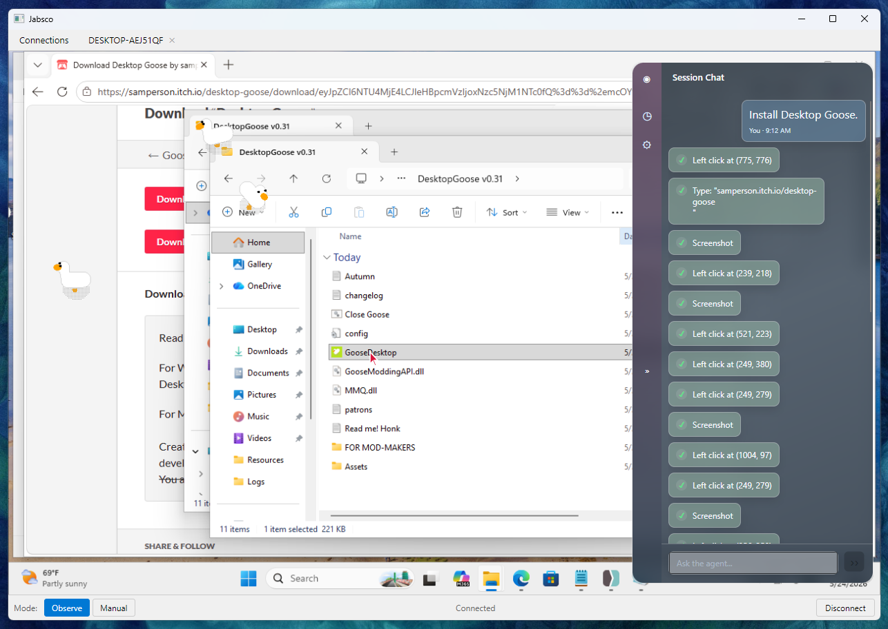

# Jabsco 🕴️ Agent of RDP

This is an RDP client that can be used to control a remote desktop using Claude.
I chose RDP because you can use it to connect to Hyper-V virtual machines - even
before an OS is installed. I'd like to use an agent to automate machine setup.
(I'm not quite there yet - this only works over straight RDP currently.)

I also like remote desktop as the agent interface because it can't do anything
outside of that connection - the virtual machine or remote user account is its
sandbox.

## Features

* GUI for chatting with the agent - also a working RDP client. (The biggest
  lift in this project was using the FreeRDP bindings directly to allow both
  agent and user access to the same session and have it be cross-platform.)

* You can have skills and commands, to bottle up prompts you want to reuse.

* Screenshots are taken automatically - and only one is kept in the conversation
  at a time - yeah that kills caching but it also keeps the context clean.
  (Screenshots can easily take 20k tokens each.)

* Observe mode: the agent locks the RDP client while it works, then releases
  control back to you when it's done. (Manual mode allows you to interfere at
  any time.)

* CLI mode. Run: `jabsco --help` for options. Use this to fire off single
  prompts.

* Works on Windows, Linux, and macOS. (I developed on Linux but tested on all
  three.)

## Quick Start

Download a release - it's just a zip file with `jabsco.exe` inside.

You'll need to put your Anthropic API key in the config file (see below) or set it as an environment variable (`ANTHROPIC_API_KEY`)
before running it.

* **macOS**: Install the `freerdp` package with Homebrew: `brew install
  freerdp`. Requires FreeRDP 3.0 or later.
* **Linux**: Install FreeRDP with your package manager. On Arch, the `freerdp`
  package is sufficient.

There may be issues running on odd architectures - like Windows or Linux on ARM.
Jabsco's custom bindings aren't quite as portable as I'd like.

## Configuration

Jabsco reads `config.toml` from its config directory on startup:

- **Linux/macOS:** `~/.config/jabsco/config.toml`
- **Windows:** `%LOCALAPPDATA%\Jabsco\config.toml`

If the file doesn't exist it is created automatically with commented-out examples.
The directory can be overridden with the `JABSCO_CONFIG_DIR` environment variable.

```toml
# Your Anthropic API key.
# Priority: --api-key CLI flag > this value > ANTHROPIC_API_KEY env var
anthropic_api_key = "sk-ant-..."

[agent]
# Override the system prompt sent to the model on every request.
# system_prompt = """
# Your cursor position is shown as a red arrow.
# Additional instructions here.
# """

# Maximum agent steps before stopping (default: 50).
# max_steps = 50

# Milliseconds to wait between a tool result and the next screenshot (default: 800).
# post_action_delay_ms = 800

# Hard time limit in seconds for a single agent run (default: no limit).
# time_budget_seconds = 300

# Tool approval policy: "allow" auto-approves all tool calls (default: prompt user).
# tool_policy = "allow"
```

### Skills and commands

User-defined reusable prompts live under the config directory:

- **Skills** (`skills/<name>/SKILL.md`) — loaded by the model on demand via the
  `load_skill` tool. Useful for role or style instructions the agent can pull in when needed.
- **Commands** (`commands/<name>.md`) — invoked from the prompt with `/name [args]`.
  The prompt is replaced with the file's content; `$ARGUMENTS` is substituted with anything typed after the command name.

These are pretty limited compared to Claude Code but hey, it's something.

## CLI Usage

The command-line interface is pretty basic for now, but you can run single prompts without opening the GUI:

```bash
jabsco run --host HOST-NAME --prompt "Open Notepad and type the first page of Oliver Twist"
```

If you previously logged into the machine at HOST-NAME using the GUI and saved
the credentials, the CLI will use those.

A stream of NDJSON events will go to stdout.

## Building Jabsco

Install [mise](https://mise.jdx.dev/installing-mise.html).

Install .NET 10: `mise use dotnet@10`.

Then: `mise build`.
